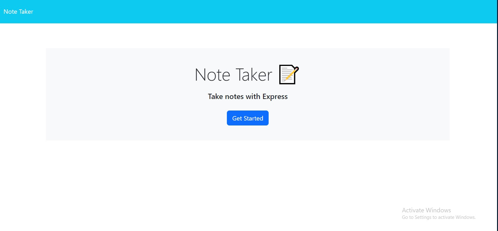
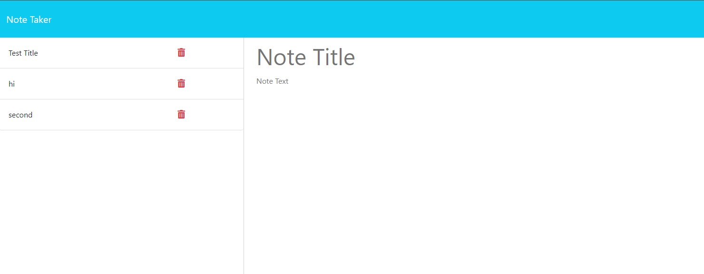

# Nelson's Readme Generator

## Descryption

Note Taker app using Express.js. Should allow you to take notes and be able to save those notes and even delete them.

## Table of Contents

1. [Installation](#installation)
2. [Usage](#usage)
3. [Credits](#credits)
4. [License](#license)
5. [Features](#features)
6. [How to Contribute](#contribute)
7. [Test](#test)
8. [Questions](#questions)

## Installation

Clone it from my Repo

## Usage

Once all the packages have been install do a 'node server.js in the terminal and you should be able to use it from the localhost:3001/

## Credits

https://shields.io/

## License

This application uses 

## Features

It uses Inquirer, Node.js, uniqid, express, and path

## How to Contribute

Contact me.

## Test

Run test however you feel like it?

## Questions

GitHub: [MartinezN2014](https://github.com/MartinezN2014/NelsonsNoteTaker)
Email: [Email](2014nmartinez@gmail.com)

